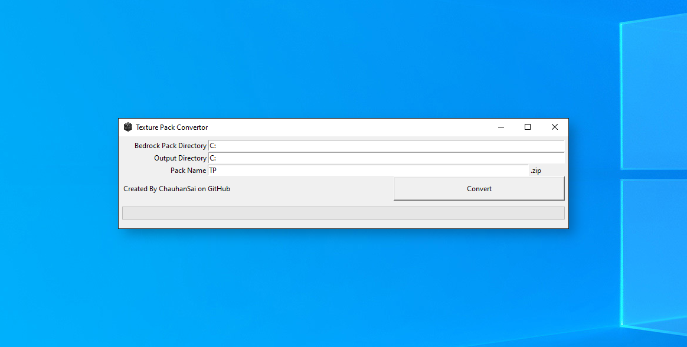
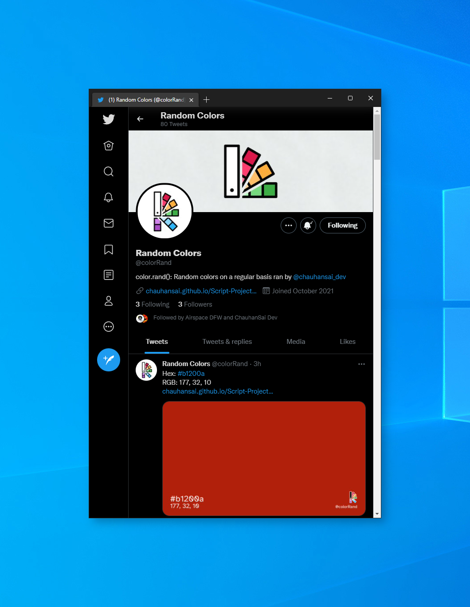

<meta charset="UTF-8">
<link rel="shortcut icon" type="image/x-icon" href="favicon.ico" />

<h2>Coding projects made with various languages </h2>

<h2>Languages</h2>
<ul>
	<li>
		<b>JavaScript </b>
	</li>
	<a style="margin-left: 40px">
		Made using Atom 
	</a>  
	

		Hosted via JSFiddle
	

	<li>
		<b>Java</b>
	</li>
	

		Built using IntelliJ IDEAi 
	

	<li>
		<b>Python</b>
	</li>
	

		Built using PyCharmii 
	

	<li>
		<b>HTML</b>
	</li>
	

		Written using Notepad++ & VSCode
	

</ul>

<h2>Releases</h2>

<section>
	<h3>Computer Science FRQ Practice</h3>
	<b>HTML</b>
	

		Computer Science FRQ Practice is a website that selects random Free Response Questions and Examinations as practice for the AP Computer Science A Exam.
	

	<a href="https://chauhansai.github.io/Script-Projects/HTML/compSciFRQ/">
		
		Visit Webpage
	</a>
	

		
	

</section>

<section>
	<h3>Texture Matrix</h3>
	<b>Python</b>
	

		<b><a href="https://github.com/ChauhanSai/Script-Projects/releases/r8/">Texture Matrix</a></b> is a Python script that creates a square matrix of textures to showcase for patch notes, blogs, social media, etc. Recomended for Minecraft Bedrock packs to emulate the visuals of Just Enough Items (JEI).
	

	

		Usage: Easily create promotional images to showcase your texture work.
	

	<!--<a href="https://github.com/ChauhanSai/Script-Projects/releases/download/r8/textureMatrix.exe">
		
		Download
	</a>
	

		
Additional Files

		 
		<a href="https://github.com/ChauhanSai/Script-Projects/releases/download/r8/textureMatrix.zip">
			
			Download Source .py
		</a>
	
-->
	

		
	

</section>

<section>
	<h3>Crafting Visualizer</h3>
	<b>Python</b>
	

		<b><a href="https://github.com/ChauhanSai/Script-Projects/releases/r7/">Crafting Visualizer</a></b> is a Python script that visualizes Minecraft Bedrock crafting recipes such that Crafting Table GUI images are created for use outside of Minecraft. 
	

	

		Usage: Create Crafting GUI images for your Minecrat Bedrock blocks and items.
	

	<!--<a href="https://github.com/ChauhanSai/Script-Projects/releases/download/r7/craftingVisuals.exe">
		
		Download
	</a>
	

		
Additional Files

		 
		<a href="https://github.com/ChauhanSai/Script-Projects/releases/download/r7/craftingVisuals.zip">
			
			Download Source .py
		</a>
	
-->
	

		
	

</section>

<section>
	<h3>Theme Engine</h3>
	<b>Python</b>
	

		<b><a href="">Theme Engine</a></b> is a Python script that creates a custom Minecraft Bedrock GUI, using the colors of your choice.
	

	

		Usage: Make your Minecraft unique using your preferred colors.
	

	<!--<a href="https://github.com/ChauhanSai/Script-Projects/releases/download/r6/texturePackConvertor.exe">
		
		Download
	</a>
	

		
Additional Files

		 
		<a href="https://github.com/ChauhanSai/Script-Projects/releases/download/r6/Texture.Pack.Convertor.zip">
			
			Download Source .py
		</a>
		 
		<a href="https://github.com/ChauhanSai/Script-Projects/releases/download/r6/texturePackConvertorCMD.py">
			
			Download CMD .py
		</a>
	

	

		
	
-->
</section>

<section>
	<h3>Texture Pack Convertor</h3>
	<b>Python</b>
	

		<b><a href="https://github.com/ChauhanSai/Script-Projects/releases/tag/r6">Texture Pack Convertor</a></b> is a Python script that converts a Minecraft Bedrock texture pack to the Minecraft Java Edition file system. All textures are converted, with the exception of mobs, to match the structure and naming convention of Java Edition and zipped into a ready to use file for Minecraft 1.18.
	

	

		Usage: Easily create texture packs for Bedrock and Java or convert an old Bedrock pack to work with Java.
	

	<a href="https://github.com/ChauhanSai/Script-Projects/releases/download/r6/texturePackConvertor.exe">
		
		Download
	</a>
	

		
Additional Files

		 
		<a href="https://github.com/ChauhanSai/Script-Projects/releases/download/r6/Texture.Pack.Convertor.zip">
			
			Download Source .py
		</a>
		 
		<a href="https://github.com/ChauhanSai/Script-Projects/releases/download/r6/texturePackConvertorCMD.py">
			
			Download CMD .py
		</a>
	

	

		
	

</section>

<section>
	<h3>ColorWaves</h3>
	<b>Python</b>
	

		<b><a href="https://github.com/ChauhanSai/Script-Projects/releases/tag/r5">ColorWaves</a></b> is a Python script that generates a grayscale and color histogram for any image.
	

	

		Usage: Generate plotted and typed histograms for any chosen image.
	

	<a href="https://github.com/ChauhanSai/Script-Projects/releases/download/r5/colorWaves.exe">
		
		Download
	</a>
	

		
Additional Files

		 
		<a href="https://github.com/ChauhanSai/Script-Projects/releases/download/r5/colorWaves.zip">
			
			Download Source .py
		</a>
	

	

		
	

</section>

<section>
	<h3>IF to KML</h3>
	<b>Python</b>
	

		<b><a href="https://github.com/ChauhanSai/Script-Projects/releases/tag/r3">IF to KML</a></b> is a Python script that retrieves the flight information from Infinite Flight flight simulator and writes it to a KML file that can be viewed in Google Earth.
	

	

		Usage: Generate 3D Flight Plans of previous flights that can be viewed in Google Earth. 
	

	<a href="https://github.com/ChauhanSai/Script-Projects/releases/download/r3/IFtoKML.exe">
		
		Download
	</a>
	

		
Additional Files

		 
		<a href="https://github.com/ChauhanSai/Script-Projects/releases/download/r3/IFtoKML.zip">
			
			Download Source .py
		</a>
		 
		<a href="https://github.com/ChauhanSai/Script-Projects/releases/download/r3/IFrecordKMLcmd.py">
			
			Download CMD .py
		</a>
	

	

		
	

</section>

<section>
	<h3>GIT Release API</h3>
	<b>Python</b>
	

		<b><a href="https://github.com/ChauhanSai/Script-Projects/releases/tag/r1">GIT Release API</a></b> is a Python script that retrieves the information of a GitHub repo's releases. Also included is a download counter for a GitHub repository.
	

	

		Usage: Using the data given from the API, counting the downloads of a GitHub repository's releases
	

	<a href="https://github.com/ChauhanSai/Script-Projects/releases/download/r1/gitReleaseDownloads.exe">
		
		Download
	</a>
	

		
Additional Files

		 
		<a href="https://github.com/ChauhanSai/Script-Projects/releases/download/r1/git-release-api.zip">
			
			Download Source .py
		</a>
	

	

		
	

</section>

<section>
	<h3>Random Colors</h3>
	<b>HTML</b>
	

		<b><a href="https://github.com/ChauhanSai/Script-Projects/releases/tag/r4">Random Colors</a></b> is a website that generates and displays random colors to use in any project.
	

	<a href="https://chauhansai.github.io/Script-Projects/HTML/randomColors/randomColors.html">
		
		Visit Webpage
	</a>
	

		
Additional Files

		 
		<a href="https://github.com/ChauhanSai/Script-Projects/releases/download/r4/randomColors.zip">
			
			Download .zip
		</a>
	

	

		
	

</section>

<section>
	<h3>color.rand()</h3>
	<b>Python</b>
	

		<b>@colorRand</b> is a twitter bot that posts daily random colors through the use of <b><a href="#random-colors">Random Colors</a></b>
	

	<a href="https://twitter.com/colorRand">
		
		Visit Twitter
	</a>
	

		
	

</section>
	
<section>
	<h3>Stripes Generator</h3>
	<b>HTML</b>
	

		<b><a href="https://github.com/ChauhanSai/Script-Projects/releases/tag/r2">Stripes Generator</a></b> is a website that allows you to create stripes faces for your Apple Watch S3 and older.
	

	<a href="https://chauhansai.github.io/Script-Projects/HTML/stripesGenerator/stripesGenerator.html">
		
		Visit Webpage
	</a>
	

		
Additional Files

		 
		<a href="https://github.com/ChauhanSai/Script-Projects/releases/download/r2/stripesGenerator.zip">
			
			Download .zip
		</a>
	

		
	

</section>

  

	

	 
	 
	 
	 
	
	</a> 
	

	
 

	iCopyright © 2022 JetBrains s.r.o. IntelliJ and the IntelliJ logo are registered trademarks of JetBrains s.r.o. 
	iiCopyright © 2022 JetBrains s.r.o. PyCharm and the PyCharm logo are registered trademarks of JetBrains s.r.o. 
	Atom logo taken and optimized from <a href="https://github.com/atom/about/blob/master/lib/components/atom-logo.js"><i>https://github.com/atom/about/blob/master/lib/components/atom-logo.js</i></a> 
	JSFiddle & VSCode logos via <i>simpleicons.org</i> 
	Notepad++ logo vectorised by <a href="https://commons.wikimedia.org/wiki/User:Vulphere">Vulphere</a> based from <a href="https://notepad-plus-plus.org/images/logo.svg"><i>https://notepad-plus-plus.org/images/logo.svg</i></a> 
	<a href="https://materialdesignicons.com/icon/tray-arrow-down">tray-arrow-down</a> made by arnoldlepineux 
	<a href="https://materialdesignicons.com/icon/zip-box-outline">zip-box-outline</a> made by Michael Irigoyen <a href="http://twitter.com/mririgo">@mririgo</a> 

